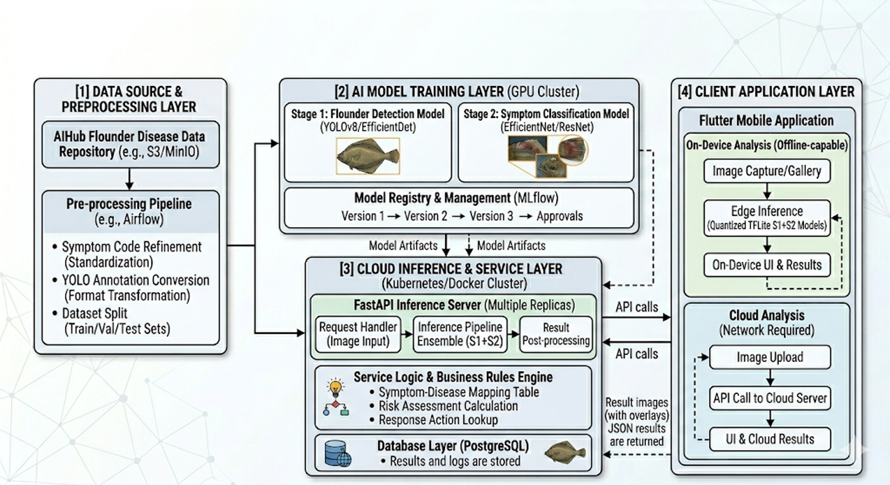

# 🐟 Flatfish Doctor — AI-Based Early Disease Detection for Olive Flounder

An end-to-end deep learning pipeline that detects individual olive flounder (Korean: 넙치 / 광어) in aquaculture tanks, classifies disease symptoms, and turns each symptom into an actionable disease diagnosis with a risk score and response guide — running both as a **FastAPI server** and as a fully **on-device Android app**.

🔗 **Source code:** https://github.com/jiwoo1105/fish-disease-detection
▶️ **Demo video (YouTube):** _`<TODO: add YouTube link>`_

---

## Introduction

In high-density olive flounder farms, disease spreads within hours and can wipe out an entire tank. Today this is caught by farm managers visually inspecting hundreds of thousands of fish — a process that is labor-intensive, inconsistent, and often too late.

**Flatfish Doctor** automates that monitoring with a two-stage computer-vision pipeline:

1. **Detect** every fish in a tank image/video stream and crop it out.
2. **Classify** each cropped fish into one of **7 symptom states**, then map the symptom to its most likely disease, mortality risk, and concrete response actions (temperature control, isolation, medication, etc.).

The result is an objective, standardized, real-time anomaly index that lets farmers act early instead of reacting to mass mortality. The same logic ships as an offline mobile app so it works at the tank-side without a server connection.

---

## Demo

▶️ **Full demo video:** _`<TODO: add YouTube link>`_

| Tank monitoring grid | Real-time detection overlay | Diagnosis & response |
|---|---|---|
|  |  |  |

The app monitors multiple tanks, draws per-fish bounding boxes with the predicted symptom and confidence (green = normal, red/orange = diseased), computes a tank-level risk level (`watch / danger / immediate`), and pops a detailed diagnosis card with pathogen, mortality rate, and step-by-step response measures.

| Detection (ulcer) | Detection results log | Diagnosis (Lymphocystis) |
|---|---|---|
|  |  |  |

---

## System Architecture

The system is organized into four layers — data & preprocessing, AI model training, cloud inference & service, and the client application. At its core is a **2-stage deep-learning pipeline (S1 + S2)**, followed by a rule-based diagnosis step that turns the predicted symptom into an actionable response.

### Stage 1 — Object Detection (fish localization)

First, the camera captures the whole tank, and the first job is to find where each individual flounder is. A **YOLO26 detection model** draws a bounding box around every fish in the frame. Aquaculture tanks are hard environments — the water is turbid, fish overlap each other, and lighting is uneven — and this model's role is to separate each fish under exactly those conditions.

Each detected box is then **cropped** out of the image. Judging disease directly from the full tank image would fail because background noise (water color, ripples, tank floor) overwhelms the signal — so only the cropped fish is passed on to Stage 2.

### Stage 2 — Symptom Classification

Each cropped fish image is fed to a **YOLO26 classification model** that decides which of **7 symptom classes** it belongs to:

`normal` · `hemorrhage` (출혈) · `white_spot` (백점) · `tumor` (반점/결절) · `color_change` (체색변화) · `emaciation` (여윔) · `ulcer` (궤양).

In other words, this model answers *"which symptom does this fish have?"*. A confidence threshold is applied: if the top prediction is below ~50%, confidence is considered insufficient and the fish is treated as `normal`. When the result is **not** `normal` — i.e. a disease is suspected — it is handed to the diagnosis step.

### Diagnosis & Risk (rule-based)

The predicted symptom is mapped through `classes.yaml` to its most likely disease (with pathogen, mortality rate, and step-by-step response actions) and combined with optional water-quality sensors (temperature, DO, pH, salinity) to compute a per-fish and per-tank risk level (`watch / danger / immediate`).

> The same S1 + S2 models run in two places: a **FastAPI cloud server** (`.pt`, PyTorch) and a fully **on-device Flutter app** (`.tflite`, offline-capable).

---

## Dataset

The models are trained on a combination of public datasets, used differently for each stage:

| Dataset | Volume used | Stage / purpose |
|---|---|---|
| **AI Hub — Flounder Disease Data** | 48,000 RGB images + 48,765 JSON labels (of 60,956) | **Stage 2 — Symptom classification (7 classes).** Annotations are mapped to classes by symptom code, then converted into cropped fish images. |
| **AI Hub — Fish Imaging Video & other sets** | ~80,000 images (of 100,200) | **Stage 1 — Flounder detection.** Underwater bounding-box labels train and validate the YOLO detection model. |
| **Roboflow fish-detection set** | ~2,000 images | **Domain reinforcement** — fish images from varied tank environments and angles, to strengthen the detection model. |

**7 symptom classes (Stage 2):** `normal`, `hemorrhage` (출혈), `white_spot` (백점), `tumor` (반점/결절), `color_change` (체색변화), `emaciation` (여윔), `ulcer` (궤양).

- **Sources:** [AI Hub](https://aihub.or.kr/) (Korean public open-data) and [Roboflow](https://roboflow.com/).
- Stage 1 (detection) is trained on underwater bounding-box labels; Stage 2 (classification) uses cropped, symptom-coded RGB images across the 7 classes.

---

## Features

- 🎯 **Multi-fish detection** in a single tank frame, robust to overlap and turbid water.
- 🔬 **7-class symptom classification** per fish.
- 🩺 **Symptom → disease mapping** with probability, pathogen, mortality rate, and step-by-step response actions.
- 🌡️ **Water-quality fusion** — optional temperature / DO / pH / salinity inputs adjust the risk score and trigger combined alerts (e.g. high temperature + Scuticociliatosis).
- 🚦 **Tank-level risk levels**: `watch → danger → immediate`.
- 📱 **Fully on-device Android app** (offline) + 🖥️ **FastAPI server** from the same model set.

---

## Results

Trained with Ultralytics YOLO. Selected runs:

**Stage 2 — Symptom Classification**

| Round | Best Epoch | Top-1 Acc | Top-5 Acc | Val Loss |
|---|---|---|---|---|
| 1 | 12 | 82.62% | 99.65% | 0.548 |
| 2 | 7 | 84.00% | 99.73% | 0.582 |
| 3 | 14 | 83.29% | 99.78% | 0.584 |
| **4 (peak)** | 21 | **87.68%** | 99.82% | 0.424 |
| 5 | 1 | 87.48% | 99.87% | 0.450 |

**Stage 1 — Object Detection**

| Round | Best Epoch | Precision | Recall | mAP50 | mAP50-95 |
|---|---|---|---|---|---|
| 1 | 47 | 0.507 | 0.431 | 0.439 | 0.237 |
| **2 (peak)** | 44 | 0.509 | 0.436 | 0.445 | 0.239 |

> Detection metrics reflect **baseline feasibility**. Overlapping flounder in dark, turbid water remain the main bottleneck; raising Stage-1 mAP above ~0.45 via cleaner positive/negative samples is the top priority (see Future Directions).

---

## Disease Mapping Reference

Symptom → most likely disease and response (from `AI/configs/classes.yaml`):

| Symptom | Suspected disease (prob.) | Pathogen | Mortality | Core response |
|---|---|---|---|---|
| Hemorrhage | VHS (40%) | VHS virus (Novirhabdovirus) | 30–70% | Isolate tank; raise temp **above 20 °C** (antibiotics ineffective) |
| White spot | Scuticociliatosis (70%) | Ciliate *Miamiensis avidus* | 50–90% | Isolate; **lower below 18 °C**; formalin bath 100 ppm |
| Spot/Nodule | Lymphocystis disease (90%) | Lymphocystivirus (Iridoviridae) | <1% | Monitor; self-heals; manage water quality |
| Color change | Scuticociliatosis (40%) | Ciliate *Miamiensis avidus* | 50–90% | Isolate; lower below 18 °C |
| Emaciation | Emaciation disease (50%) | Malnutrition / chronic stress | <10% | Improve nutrition; check feeding |
| Ulcer | Vibriosis (60%) | *Vibrio anguillarum / vulnificus* | 20–50% | Isolate + antibiotics; keep below 25 °C |

A risk score combines per-symptom severity, the share of diseased fish in a tank, and water-quality readings to produce the final `watch / danger / immediate` level.

---

## Limitations

- **No real diseased-fish video for testing.** No real underwater video of diseased flounder was available. One test clip was sourced from YouTube and the other three were AI-generated (Adobe Firefly, Runway). These differ from real farm footage in water color, fish texture, and disease appearance, so performance in actual aquaculture environments remains unverified.
- **No sensor integration.** The system relies solely on visual image analysis. Real disease management also needs environmental sensors — water temperature, dissolved oxygen, pH, salinity. Without them, the system cannot correlate outbreaks with conditions (e.g. scuticociliatosis accelerates above 20 °C) or trigger temperature-based automated responses.

---

## Future Directions

- **Real farm data collection.** Partner with Jeju flounder farms to collect real underwater disease footage and retrain the models on actual tank environments, bridging the domain gap between lab photos and murky underwater conditions.
- **Sensor integration + AI fusion.** Fuse water-quality sensors (temperature, DO, pH, salinity) with visual detection — e.g. if white spot is detected **and** water temperature exceeds 20 °C, automatically escalate the alert and recommend lowering the temperature.
- **Real-time edge deployment.** Convert models to TFLite/ONNX for on-device inference on mobile (Flutter) and edge hardware (Jetson Nano, Raspberry Pi), enabling offline real-time diagnostics at the farm without server dependency.
- **Disease alert with visual evidence.** On detection, attach the cropped diseased-fish photo to push notifications, so managers receive the disease name, risk level, recommended actions, and the evidence photo — enabling faster decisions without checking the camera.

