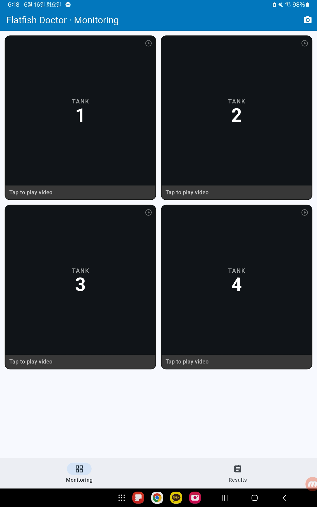
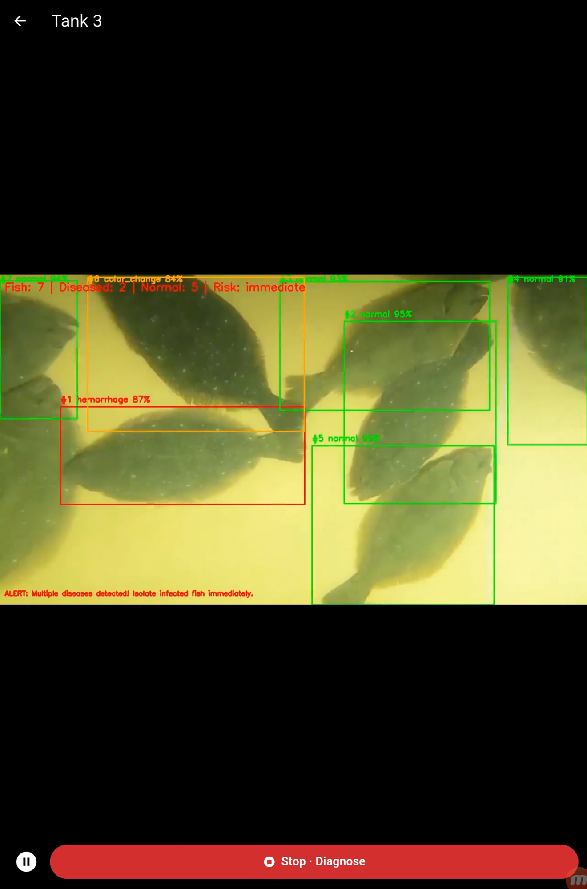
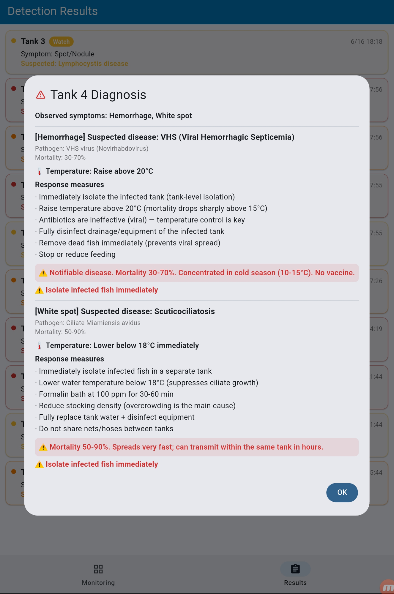
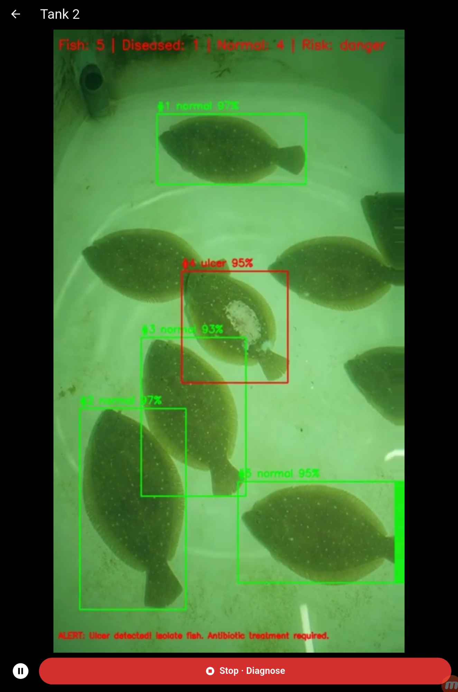
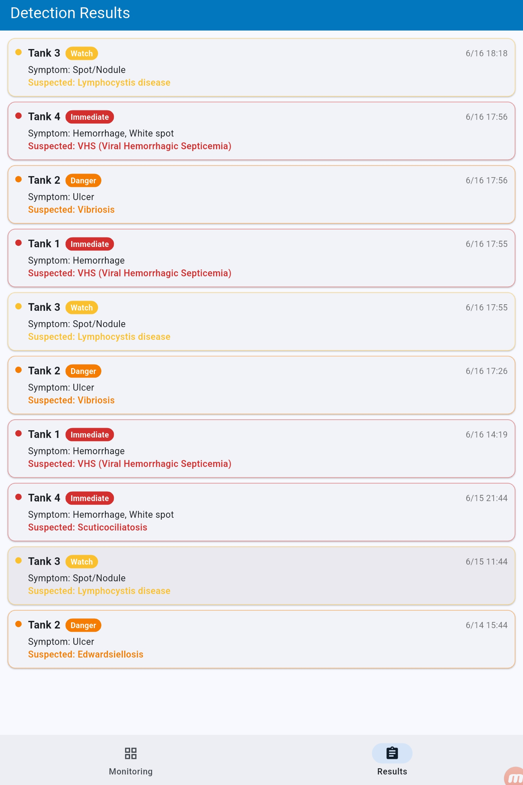
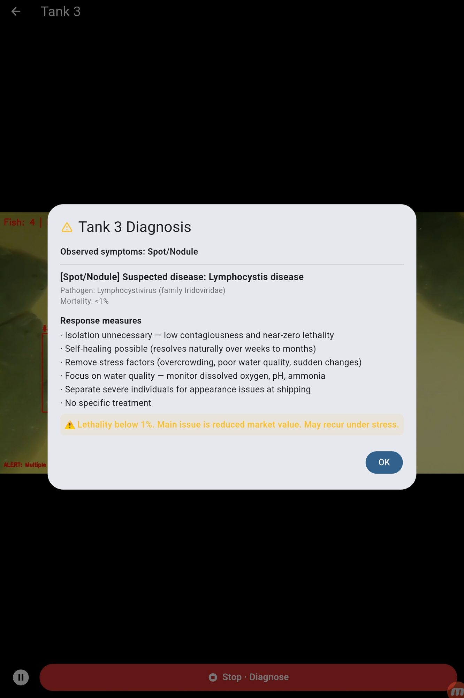

# 🐟 Flatfish Doctor — AI-Based Early Disease Detection for Olive Flounder

[](https://www.python.org/)
[](https://flutter.dev/)
[](https://github.com/ultralytics/ultralytics)
[](https://fastapi.tiangolo.com/)

An end-to-end deep learning pipeline that detects individual olive flounder (Korean: 넙치 / 광어) in aquaculture tanks, classifies disease symptoms, and turns each symptom into an actionable disease diagnosis with a risk score and response guide — running both as a **FastAPI server** and as a fully **on-device Android app**.

🔗 **Source code:** https://github.com/jiwoo1105/fish-disease-detection

▶️ **Demo video (YouTube):** _`<TODO: add YouTube link>`_

---

## Introduction

In high-density olive flounder farms, disease spreads within hours and can wipe out an entire tank. Today this is caught by farm managers visually inspecting hundreds of thousands of fish — a process that is labor-intensive, inconsistent, and often too late.

**Flatfish Doctor** automates that monitoring with a two-stage computer-vision pipeline:

1. **Detect** every fish in a tank image/video stream and crop it out.
2. **Classify** each cropped fish into one of **7 symptom states**, then map the symptom to its most likely disease, mortality risk, and concrete response actions (temperature control, isolation, medication, etc.).

The result is an objective, standardized, real-time anomaly index that lets farmers act early instead of reacting to mass mortality. The same logic ships as an offline mobile app so it works at the tank-side without a server connection.

**Key contributions**
- 2-stage *detect → classify* vision pipeline tuned for turbid water and low-light indoor tanks.
- A curated **symptom → disease → response** knowledge base (`classes.yaml`) co-designed with aquaculture disease references.
- Risk scoring that fuses visual symptoms with optional **water-quality sensors** (temperature, DO, pH, salinity).
- Two deployment targets from one model set: a **FastAPI** service and an **on-device Flutter** app.

---

## Demo

▶️ **Full demo video:** _`<TODO: add YouTube link>`_

| Tank monitoring grid | Real-time detection overlay | Diagnosis & response |
|---|---|---|
|  |  |  |

The app monitors multiple tanks, draws per-fish bounding boxes with the predicted symptom and confidence (green = normal, red/orange = diseased), computes a tank-level risk level (`watch / danger / immediate`), and pops a detailed diagnosis card with pathogen, mortality rate, and step-by-step response measures.

<details>
<summary>More screenshots</summary>

| Detection (ulcer) | Detection results log | Diagnosis (Lymphocystis) |
|---|---|---|
|  |  |  |

</details>

---

## System Architecture / Block Diagram

```
                 ┌─────────────────────────────────────────────┐
                 │   Camera / Image / Video  (tank monitoring)  │
                 └───────────────────────┬─────────────────────┘
                                         │
        ┌────────────────────────────────▼────────────────────────────────┐
        │  STAGE 1 — Object Detection  (YOLO det)                          │
        │  Locate every flounder → bounding boxes                         │
        └────────────────────────────────┬────────────────────────────────┘
                                         │  crop each fish (remove background noise)
        ┌────────────────────────────────▼────────────────────────────────┐
        │  STAGE 2 — Symptom Classification  (YOLO cls)                    │
        │  normal · hemorrhage · white_spot · tumor ·                      │
        │  color_change · emaciation · ulcer                              │
        └────────────────────────────────┬────────────────────────────────┘
                                         │  (server only) optional Stage 2.5
        ┌────────────────────────────────▼────────────────────────────────┐
        │  STAGE 2.5 — Lesion Localization  (YOLO lesion_det) [optional]   │
        └────────────────────────────────┬────────────────────────────────┘
                                         │
        ┌────────────────────────────────▼────────────────────────────────┐
        │  STAGE 3 — Disease Mapping & Risk Scoring  (classes.yaml)        │
        │  symptom → suspected disease (probability, pathogen, mortality)  │
        │  + water-quality sensors → per-fish & per-tank risk score        │
        └────────────────────────────────┬────────────────────────────────┘
                                         │
        ┌────────────────────────────────▼────────────────────────────────┐
        │  OUTPUT — Risk level (watch/danger/immediate) + response guide   │
        │  FastAPI JSON  ·  Annotated image  ·  On-device app alert card   │
        └─────────────────────────────────────────────────────────────────┘
```

**Two deployment targets share the same models:**

| | Pipeline | Runtime | Models |
|---|---|---|---|
| **Server** (`AI/server`) | 3-stage (det → cls → lesion) + mapping | FastAPI / Uvicorn | `.pt` (PyTorch) |
| **Mobile** (`FRONT`) | 2-stage (det → cls) + mapping | On-device, offline | `.tflite` (float32) |

---

## Training Data

- **Source:** AIHub — *Olive Flounder Disease Data* (넙치 질병 데이터), a public Korean government open-data set.
  🔗 https://aihub.or.kr/aihubdata/data/view.do?currMenu=115&topMenu=100&dataSetSn=71345

### Dataset description

| Property | Value |
|---|---|
| Modality | High-resolution RGB images (6000 × 4000 JPG) |
| Volume | ~916 GB total (full set); RGB subset used for training |
| Image count | **48,765** training + **6,096** validation (RGB) |
| Label format | JSON, COCO-like (`images` + `annotations` with bounding boxes) |
| Raw labels | 21 disease codes + 31 symptom codes per annotation |
| Extra metadata | body weight, body length, growth level (juvenile/sub-adult/adult) |
| Collection method | Expert-curated tank imagery with veterinary ground-truth labels (AIHub) |

### Label classes used (Stage 2)

The 31 raw AIHub symptom codes are consolidated into **7 target classes**:

| Class | Korean | Source symptom codes |
|---|---|---|
| `normal` | 정상 | symptom_type = null |
| `hemorrhage` | 출혈 | 1, 2 |
| `white_spot` | 백점 | 10 |
| `tumor` | 반점/결절 | 4 |
| `color_change` | 체색변화 | 3 |
| `emaciation` | 여윔 | 22 |
| `ulcer` | 궤양 | 11, 12 |

Codes for ambiguous/non-target symptoms (exophthalmia, abdominal swelling, gill anomaly, etc.) are excluded. Preprocessing standardizes raw JSON coordinates, removes redundant background, and produces a stratified train/validation split. See `AI/PROJECT_PLAN.md` and `AI/configs/classes.yaml` for the full mapping.

> ⚠️ The raw dataset is **not** redistributed in this repository — download it from AIHub directly. A small set of sample images lives in `test_samples/` for quick testing.

---

## Features

- 🎯 **Multi-fish detection** in a single tank frame, robust to overlap and turbid water.
- 🔬 **7-class symptom classification** per fish.
- 🩺 **Symptom → disease mapping** with probability, pathogen, mortality rate, and step-by-step response actions.
- 🌡️ **Water-quality fusion** — optional temperature / DO / pH / salinity inputs adjust the risk score and trigger combined alerts (e.g. high temperature + Scuticociliatosis).
- 🚦 **Tank-level risk levels**: `watch → danger → immediate`.
- 📱 **Fully on-device Android app** (offline) + 🖥️ **FastAPI server** from the same model set.

---

## Results

Trained with Ultralytics YOLO. Selected runs:

**Stage 2 — Symptom Classification**

| Round | Best Epoch | Top-1 Acc | Top-5 Acc | Val Loss |
|---|---|---|---|---|
| 1 | 12 | 82.62% | 99.65% | 0.548 |
| 2 | 7 | 84.00% | 99.73% | 0.582 |
| 3 | 14 | 83.29% | 99.78% | 0.584 |
| **4 (peak)** | 21 | **87.68%** | 99.82% | 0.424 |
| 5 | 1 | 87.48% | 99.87% | 0.450 |

**Stage 1 — Object Detection**

| Round | Best Epoch | Precision | Recall | mAP50 | mAP50-95 |
|---|---|---|---|---|---|
| 1 | 47 | 0.507 | 0.431 | 0.439 | 0.237 |
| **2 (peak)** | 44 | 0.509 | 0.436 | 0.445 | 0.239 |

> Detection metrics reflect **baseline feasibility**. Overlapping flounder in dark, turbid water remain the main bottleneck; raising Stage-1 mAP above ~0.45 via cleaner positive/negative samples is the top priority (see Roadmap).

---

## Repository Structure

```
fish-disease-detection/
├── AI/                          # Python: training, inference, server
│   ├── configs/classes.yaml     # symptom↔disease↔response + risk rules (knowledge base)
│   ├── scripts/
│   │   ├── prepare_multiclass.py    # AIHub JSON → YOLO dataset (7-class)
│   │   ├── train_det.py / train_cls.py / train_seg.py / train_lesion_det.py
│   │   ├── inference.py             # 3-stage inference (image / video)
│   │   ├── disease_mapper.py        # symptom → disease
│   │   ├── risk_scorer.py           # sensor & tank risk scoring
│   │   └── run_all.py               # prepare → train end-to-end
│   ├── server/main.py           # FastAPI app
│   ├── models/{det,cls,seg,lesion_det}/best_*.pt
│   └── PROJECT_PLAN.md
├── FRONT/                       # Flutter Android app "넙치닥터 / Flatfish Doctor"
│   ├── lib/                     # det→crop→cls pipeline + disease config UI
│   └── README.md                # app-specific build guide
├── test_samples/                # sample images by symptom
└── docs/screenshots/            # app screenshots (this README)
```

---

## Getting Started

### A. AI pipeline & server (Python)

```bash
cd AI
python -m venv venv && source venv/bin/activate      # Windows: venv\Scripts\activate
pip install -r requirements.txt

# 1) Prepare dataset from AIHub labels (after downloading the data)
python scripts/prepare_multiclass.py

# 2) Train (data prep → detection → classification)
python scripts/run_all.py

# 3) Run inference on a single image or video
python scripts/inference.py --image path/to/image.jpg
python scripts/inference.py --video path/to/video.mp4

# 4) Serve the API
uvicorn server.main:app --host 0.0.0.0 --port 8000
```

**API endpoints**

| Method | Endpoint | Description |
|---|---|---|
| `POST` | `/api/analyze` | Upload an image (+ optional `temperature`, `do`, `ph`, `salinity`) → 2/3-stage inference → JSON result + annotated image (base64) |
| `GET`  | `/api/diseases/{symptom}` | Resolve a symptom to its candidate disease profiles |
| `GET`  | `/api/classes` | List supported symptom classes |
| `GET`  | `/api/health` | Health / model-load check |

### B. Android app (Flutter)

```bash
cd FRONT
flutter pub get
dart test test/logic_test.dart        # pure-Dart logic checks
flutter build apk --debug             # or: flutter run
```

The app runs `det.tflite` + `cls.tflite` on-device (no server) and reads `assets/config/classes.yaml` for the disease mapping. See [`FRONT/README.md`](FRONT/README.md) for build details (incl. a Windows non-ASCII path workaround).

---

## Disease Mapping Reference

Symptom → most likely disease and response (from `AI/configs/classes.yaml`):

| Symptom | Suspected disease (prob.) | Pathogen | Mortality | Core response |
|---|---|---|---|---|
| Hemorrhage | VHS (40%) | VHS virus (Novirhabdovirus) | 30–70% | Isolate tank; raise temp **above 20 °C** (antibiotics ineffective) |
| White spot | Scuticociliatosis (70%) | Ciliate *Miamiensis avidus* | 50–90% | Isolate; **lower below 18 °C**; formalin bath 100 ppm |
| Spot/Nodule | Lymphocystis disease (90%) | Lymphocystivirus (Iridoviridae) | <1% | Monitor; self-heals; manage water quality |
| Color change | Scuticociliatosis (40%) | Ciliate *Miamiensis avidus* | 50–90% | Isolate; lower below 18 °C |
| Emaciation | Emaciation disease (50%) | Malnutrition / chronic stress | <10% | Improve nutrition; check feeding |
| Ulcer | Vibriosis (60%) | *Vibrio anguillarum / vulnificus* | 20–50% | Isolate + antibiotics; keep below 25 °C |

A risk score combines per-symptom severity, the share of diseased fish in a tank, and water-quality readings to produce the final `watch / danger / immediate` level.

---

## Roadmap

- **Visual-noise robustness** — turbid water, lighting changes, and dynamic swimming still cause normal tissue to be misread as lesions.
- **Dataset refinement** — add more clean positive/negative samples to push Stage-1 mAP above the 0.45 target.
- **Confidence-gate fix (app)** — the mobile app currently uses a high `0.85` classification gate as a stop-gap against false positives in turbid water; the proper fix is fine-tuning `best_cls.pt` on real tank imagery and restoring a normal threshold.
- **Edge deployment** — broaden TFLite/ONNX optimization for offline, low-power farm hardware.

---

## Tech Stack

**AI:** Python, Ultralytics YOLO, PyTorch, OpenCV, FastAPI, Uvicorn
**Mobile:** Flutter / Dart, `ultralytics_yolo` (on-device TFLite/CoreML)
**Data:** AIHub Olive Flounder Disease Dataset

## Data & Image Sources

- Training data: [AIHub — Olive Flounder Disease Data](https://aihub.or.kr/aihubdata/data/view.do?currMenu=115&topMenu=100&dataSetSn=71345)
- Reference imagery (presentation): www.worldfishing.net, icons by www.flaticon.com

## License

_`<TODO: choose a license, e.g. MIT>`_
